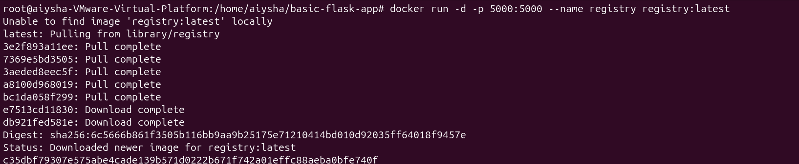
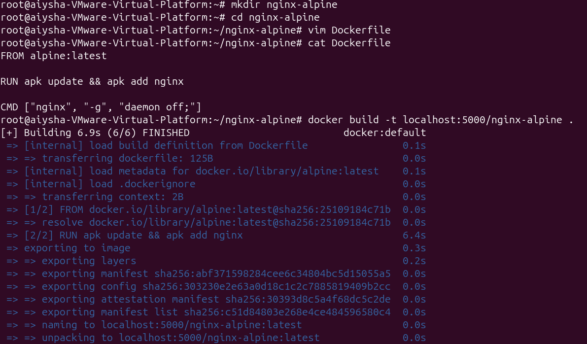

```markdown
# Lab 3 – Docker Private Registry with Nginx Alpine
# Part 1

This lab demonstrates how to:
1. Run an **insecure Docker registry** locally.
2. Build a custom Docker image that installs and runs **Nginx** based on `alpine:latest`.
3. Push the image to the private registry.
4. Test pulling the image back from the registry.

---

## Step 1: Run an Insecure Registry
Start a local registry container:

```bash
docker run -d -p 5000:5000 --restart=always --name registry registry:2
```


## Step 2: Allow Insecure Registry
By default, Docker requires HTTPS. Configure Docker to allow HTTP:

1. Create `/etc/docker/daemon.json` if it doesn’t exist:
   ```bash
   vim /etc/docker/daemon.json
   ```

2. Add:
   ```json
   {
     "insecure-registries": ["localhost:5000"]
   }
   ```

3. Restart Docker:
   ```bash
   systemctl restart docker
   ```


## Step 3: Create a Dockerfile for Nginx
Make a new directory and Dockerfile:

```bash
mkdir nginx-alpine && cd nginx-alpine
vim Dockerfile
```

Contents:

```dockerfile
FROM alpine:latest
RUN apk update && install nginx
CMD ["nginx", "-g", "daemon off;"]
```

**Explanation:**
- `CMD ["nginx", "-g", "daemon off;"]`: Run Nginx in foreground so Docker can manage it.

---

## Step 4: Build the Image
```bash
docker build -t localhost:5000/nginx-alpine .
```

- `-t localhost:5000/nginx-alpine`: Tags image with registry address and name.
- `.`: Build context is current directory.

---


## Step 5: Push the Image
```bash
docker push localhost:5000/nginx-alpine
```

This uploads the image to your local registry.

---

## Step 6: Test the Registry
1. List repositories:
   ```bash
   curl http://localhost:5000/v2/_catalog
   ```

2. Pull the image back:
   ```bash
   docker pull localhost:5000/nginx-alpine
   ```

---


